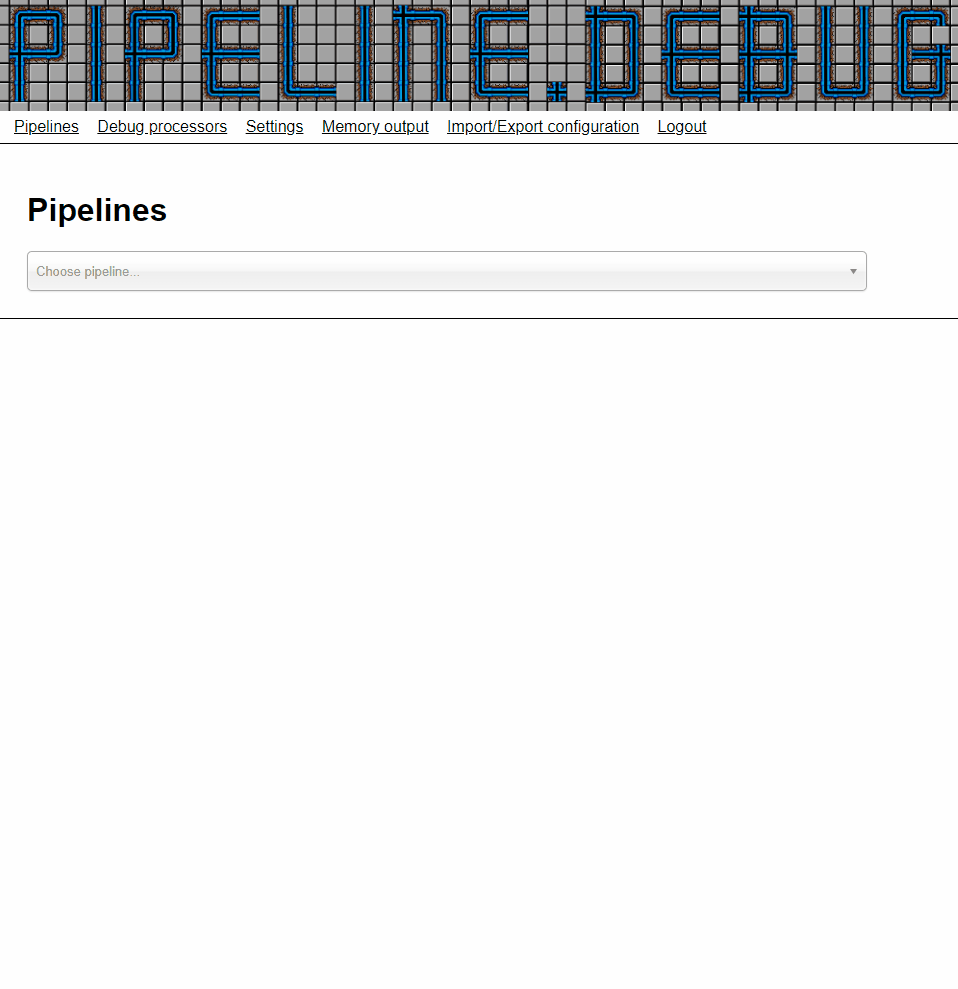
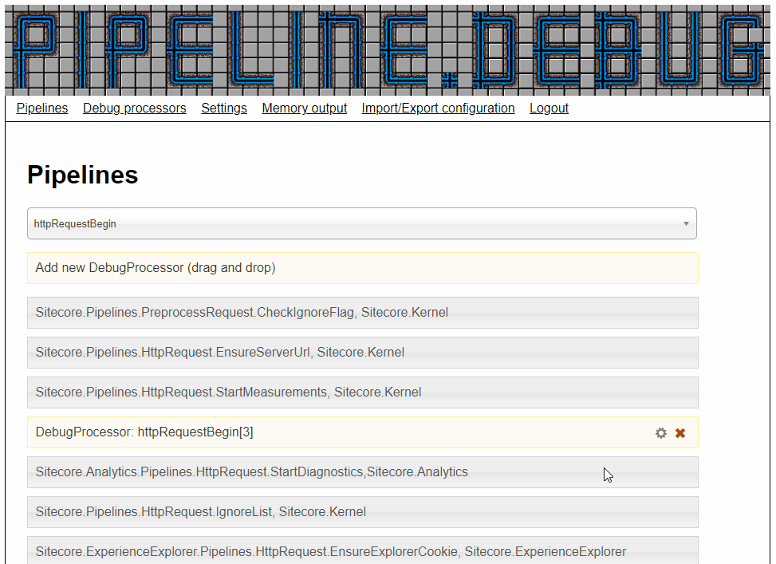
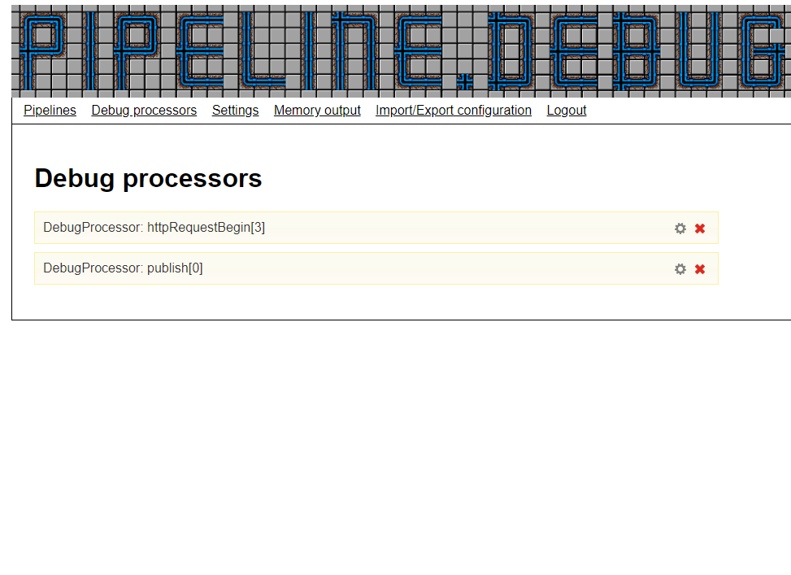
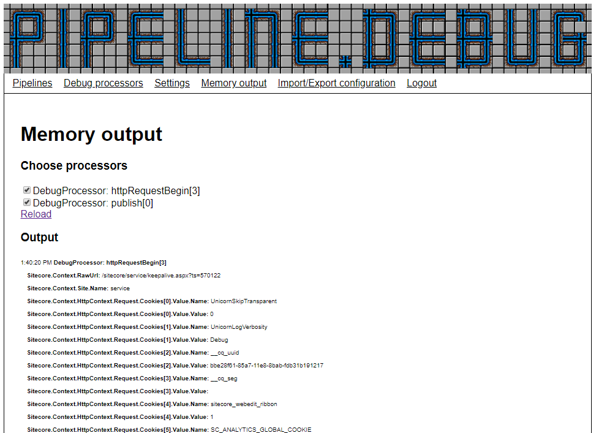

# pipeline.debug

pipeline.debug is a tool for debugging Sitecore pipelines. Once it's on the server, you can add processors to any Sitecore pipeline, and output properties and fields from the pipeline's arguments and Sitecore.Context. It is tested on Sitecore 8.2 and Sitecore 9.0.

The tool is intended for Sitecore developers with basic knowledge of the Sitecore Pipeline architecture and reflection of Sitecore's code in order to debug complex bugs.

Installation can happen by cloning this repository and make a build. Then copy contents of the /App_Config and /sitecore folders, and copy the PipelineDebug.dll to the bin folder. I will add it to the Sitecore Marketplace as well.

After installation, simply go to [scheme]://[host]/sitecore/admin/pipelinedebug.html and you can start setting up your debugging session. It requires the user to be a Sitecore Administrator, it will prompt you to login if you are not (In Sitecore 9+, just accessing /sitecore/admin/* requires admin login).

## Adding processors to a pipeline

Go to the Pipelines window to add new processors. Simply choose the pipeline you wish to add a new (or move an existing) debugprocessor to. Then you can simply drag and drop debugprocessors to a given spot in the pipeline.

In the below example we add a debugprocessor to the httpRequestBegin pipeline.

You can add multiple processors to a pipeline, as well as adding processors to multiple pipelines.

## Setting up which values to output

Each configured debugprocessor has an icon to open the edit overlay. This overlay let's you decide which values you wish to output from the pipelines arguments and Sitecore.Context. At the top the currently selected values are shown. A newly added processor will automatically have any default taxonomies from settings added. You can add additional taxonomies either by writing them in the textboxes (once selected, a new textbox will pop up), or by using the discovery feature at the bottom. 

In the below example I choose that I wish to output the cookies of the request in my httpRequestBegin pipeline.

The discovery uses reflection to find all properties and fields (public or private) of the given types. The list is however not necesarily exhaustive, since we can only find the members of the declared types, and not possible inherited types used in it's stead. This is for instance clearly displayed when using Sitecore Commerce's ServicePipelineArgs, where the ServiceProviderRequest and ServiceProviderResult is always an inherited class with context-specific members. This problem only exists at discovery time. When the debugprocessor is run, it will run on the runtime type, and all members will be found. This means that any taxonomies added via the textboxes, will work - this will however require you to do some reflection on your own, in order to find the values.

## Managing configured processors

The Processors window gives an overview of all active processors. Here you can easily edit or remove each processor.

## Managing the settings

The settings window allows you to add global constraints to debugprocessors, setup logging details and setting default taxonomies for new debugprocessors. 

All settings are read on startup from the PipelineDebug.config file. If you prefer other defaults, set them here.

### Setting constraints

Below I describe the constraint possibilities of the settings. Common for all of them is that empty/unchecked value adds no constraints.

* **Only output from current session** - checkbox. If checked, only requests from the current browsersession (the last browser to clicks the Save button) will be logged.
* **Site constraint** - sitename. Will only allow logging if the Sitecore.Context.Site.Name matches.
* **Language constraint** - languagename. Will only allow logging if the Sitecore.Context.Language.Name matches.
* **Include url** - regular expression. Will only allow requests that match the given url to be logged.
* **Exclude url** - regular expression. Will filter any requests on urls that matches the setting. By default the pipelinedebug requests is filtered.

### Output settings

By default all output will be logged both to file and memory. The file logger is defined in the PipelineDebug.config file.

To ensure that PipelineDebug does not end up in an OutOfMemoryException, there are constraints on amount of log entries as well as how many iterations of enumerables will be done. Depending on need of logging and memory on the server, these can be changed, but if you need large datasets, I recommend you to go with the filelogging.

### Default taxonomies

Whenever a new debugprocessor is added, it's given the taxonomies set in Default Taxonomies. Per default these are set for the request url an the site. However for background processes these won't be set (it doesn't break the debugprocessor, it just prints that the value was not present).

## Memory output

The Memory output window allows you to see the output from all processors. As of now you can only filter on processor type. Additional dynamic filters might be added in the future.

The formatting of the output isn't much to talk about as of now. It's just a timestamp and which processor, followed by the values of all the selected taxonomies. I've considered many things such as folding/unfolding, making bigger titles etc. But I really find that it depends on the selected data and the amount of logs which solution is better. Any input on how to improve this is very welcome. Look me up @morten.engel on the Sitecore Slack.

## Importing and exporting configuration

The tool is designed as runtime only. If you want permanent logging in pipelines, you should create and configure the according processor (It wouldn't be hard to expand functionality to autoload an entire configuration, but real logging should be made in real processors). However sometimes you might want to be able to recreate the same setup easily. Once you're done with your configuration, just go to the Import/Export configuration window, and copy the JSON value from the Current Configuration textarea. Next time you want to create (or reset) to this configuration. Simply paste it to the Import Configuration textarea, and click Import.

## A word of caution

While the tool is limited to outputting values of fields and properties, it's not without risk. Consider for instance a lazy property "B" that is not supposed to be set until "A" has already been set. If you add a debugprocessor before "A" is set, and output "B", "B" will have the wrong value, not just for your own debugging output, but any following uses. If you're unsure what a property does, at least test the processor on a non-production environment before running it on production.

## Changing the UI

I'm not much a frontender, I know. If you want to change something, feel free to change it in the html/js/css files included. If you're changing it for the better, you're welcome to make a merge request on a fork (but don't make it in some frontend framework that I'll have to learn to edit it myself).

